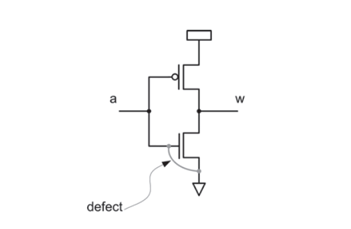
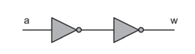
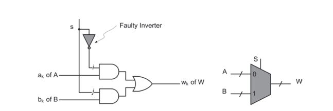
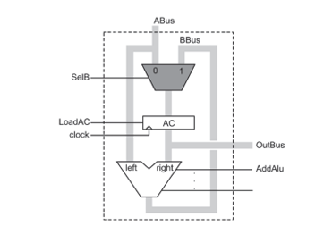
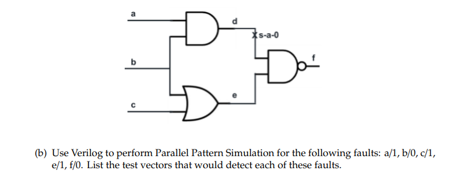

# DFT
## Fault Simulation

### Switch/Transistor level: CMOS inverter with defect

### Gate Level: Buffer using inverter

### Circuit level: Multiplexer (faulty)

### System Level: System integrated with faulty MUX

 
##Parallel Fault Simulation

### Parallel Pattern Simulation

