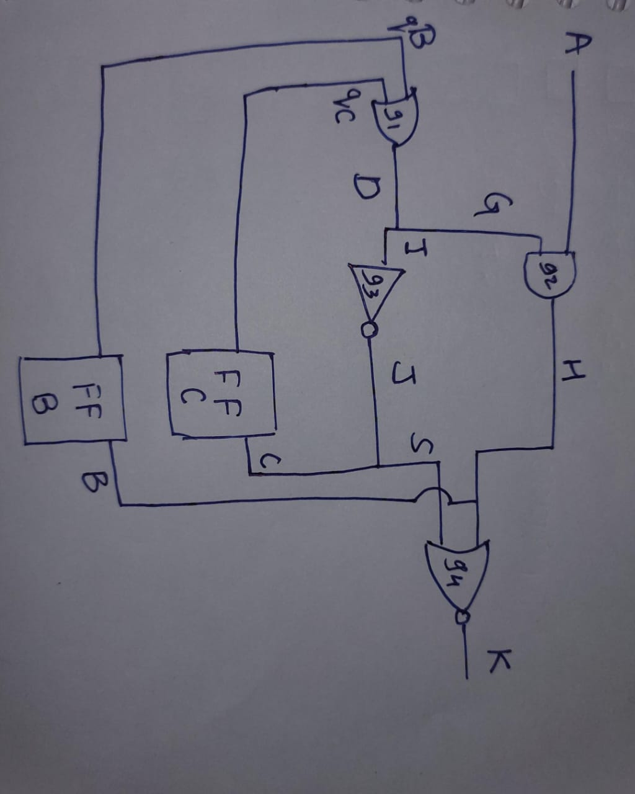
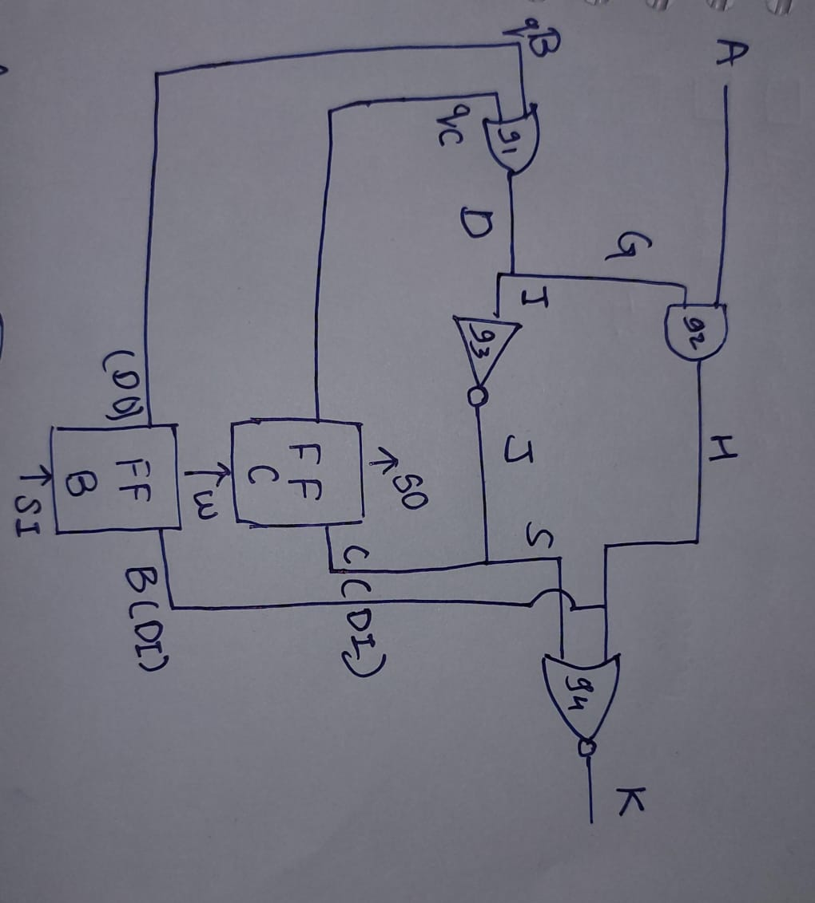

## This mini project is for understanding scan chains,

# without scan cell

# with scan insertion

Scan chains link flip-flops into shift registers for testing.

Test patterns are shifted in to control internal states.

Results are shifted out to observe circuit behavior.

This speeds up ATPG and improves fault coverage.

Testing becomes faster and more effective.